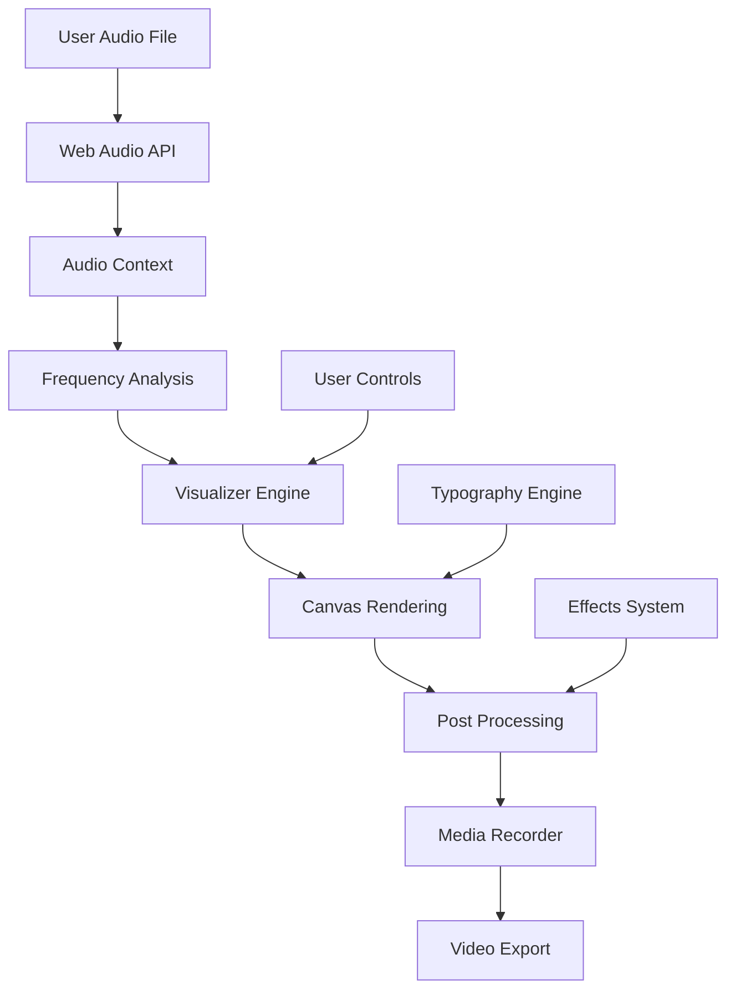

# 🎵 Muzyv

<div align="center">


**Professional Audio Visualizer | High-Performance | Client-Side Processing**


[](https://github.com/thebitcoinman/Muzyv/stargazers)
[](https://github.com/thebitcoinman/Muzyv/network)
[](https://github.com/thebitcoinman/Muzyv/issues)
[](https://github.com/thebitcoinman/Muzyv/blob/main/LICENSE)
[](https://hub.docker.com/)
[](https://reactjs.org/)
[](https://www.typescriptlang.org/)

[🚀 Quick Start](#-quick-start) • [📖 Features](#-features) • [🎨 Visualizers](#-visualizers) • [🐳 Docker Setup](#-docker-setup) • [🛠 Tech Stack](#-tech-stack)

</div>

---

## ✨ About Muzyv

Muzyv is a **high-performance, client-side audio visualization application** that creates stunning, professional music videos directly in your browser. With **no backend processing required**, Muzyv leverages modern web technologies to deliver real-time audio-reactive visualizations with export capabilities.

### 🎯 Why Choose Muzyv?

- **🔒 Privacy First:** All processing happens locally in your browser
- **⚡ Lightning Fast:** Hardware-accelerated rendering with Web Audio API
- **🎬 Studio Quality:** Export high-resolution videos with VP9 encoding
- **🎨 Creative Freedom:** 31+ unique visualizers with extensive customization
- **📱 Cross-Platform:** Works on any modern browser, no installation needed

---

## 🚀 Quick Start

Muzyv is a fully client-side application. You can run it easily using either **Docker** or **NPM**.

### Option 1: Pinokio (Recommended)
Ideal for users who want a simple, one-click installation and management experience.
1. Download and install [Pinokio](https://pinokio.computer/)
2. Open Pinokio and search for `Muzyv` or paste the URL: `https://github.com/thebitcoinman/muzyv-pinokio`
[](https://pinokio.computer/)

### Option 2: Docker (Containerized)
Ideal for quick deployment without installing Node.js locally.
```bash
git clone https://github.com/thebitcoinman/Muzyv.git
cd Muzyv
docker-compose up -d
```
🎉 Access at `http://localhost:3000`

### Option 3: NPM (Local Development)
Ideal for developers or those who prefer running directly on their system.
```bash
git clone https://github.com/thebitcoinman/Muzyv.git
cd Muzyv/muzyv_frontend
npm install
npm run dev
```
🎉 Access at `http://localhost:5173`

---

## 🛠 Setup & Installation

### Docker Deployment
The Docker setup uses Nginx to serve the optimized production build.
- **Build & Run:** `docker-compose up --build -d`
- **Stop:** `docker-compose down`

### Local NPM Development
Muzyv is built with Vite and React.
1. **Navigate to project:** `cd muzyv_frontend`
2. **Install dependencies:** `npm install`
3. **Start development server:** `npm run dev`
4. **Build for production:** `npm run build`
   *The output will be in the `dist/` folder, which can be served by any static web server.*

## 🎨 Features

### 🎵 Audio Capabilities
- **Real-time Analysis:** Frequency spectrum and waveform analysis
- **Reactive Elements:** Visuals respond to beats, frequencies, and dynamics
- **Audio Export:** High-quality `.webm` video with preserved audio
- **Format Support:** MP3, WAV, OGG, and all browser-supported formats

### 🎭 Visual Effects
- **31+ Visualizers:** From spectrum bars to fractal trees
- **Typography System:** 70+ Google Fonts with audio-reactive text
- **Post-Processing:** Glitch, RGB shift, kaleidoscope effects
- **Yo-Yo Looping:** Seamless background video loops
- **Particle Systems:** Dynamic audio-reactive particles

### 🛠 Export Features
- **Professional Quality:** 8Mbps bitrate VP9 encoding
- **High Resolution:** Up to 4K video export capability
- **Real-time Preview:** Live preview before export
- **Multiple Formats:** WebM with future format support planned

---

## 🌈 Visualizers Library

| Category | Visualizers |
|----------|-------------|
| **🎸 Classic** | Spectrum, Dual Wave, Circular Spectrum |
| **🌀 Geometric** | DNA Helix, 3D Cubes, Spheres, Plasma |
| **🌳 Nature** | Fractal Trees, Floating Orbs, Clouds |
| **🌆 Cyber** | Matrix Rain, Neon Grids, Cyber Rings |
| **✨ Particles** | Particle Storm, Starfield, Fireflies |
| **🎭 Artistic** | Paint Drips, Sketch Lines, Watercolor |

---

## 🐳 Docker Setup

### Production Deployment

<details>
<summary>📋 Production-ready Docker setup</summary>

**Quick Start:**
```bash
# Clone and deploy
git clone https://github.com/thebitcoinman/Muzyv.git
cd Muzyv
docker-compose up -d

# Access at http://localhost:3000
```

**Advanced Configuration:**
```bash
# Build custom image
docker build -t muzyv-custom .

# Run with custom port
docker run -d -p 8080:80 --name muzyv muzyv-custom

# With environment variables
docker run -d -p 3000:80 \
  -e NODE_ENV=production \
  --name muzyv \
  muzyv-frontend
```

</details>

### 🛠 Development with Docker

<details>
<summary>📋 Development Docker workflow</summary>

```bash
# Development mode with hot reload
docker-compose -f docker-compose.dev.yml up

# Build for production
docker-compose build --no-cache

# View logs
docker-compose logs -f
```

</details>

---

## 🛠 Tech Stack

### Frontend
- **[React](https://reactjs.org/)** 18.3.1 - Modern UI framework
- **[TypeScript](https://www.typescriptlang.org/)** 5.9.3 - Type-safe development
- **[Vite](https://vitejs.dev/)** 6.0.0 - Lightning-fast build tool
- **[Tailwind CSS](https://tailwindcss.com/)** - Utility-first styling

### Audio & Graphics
- **Web Audio API** - Real-time audio processing
- **Canvas API** - Hardware-accelerated graphics
- **MediaRecorder API** - Video export capabilities
- **WebGL** - GPU-accelerated effects (coming soon)

### Deployment
- **[Nginx](https://nginx.org/)** - Production web server
- **[Docker](https://www.docker.com/)** - Containerization
- **[GitHub Actions](https://github.com/features/actions)** - CI/CD (planned)

---

## 🏗 Architecture



---

## 📚 API Reference

### Core Hook: `useAudioAnalyzer`

```typescript
const {
  isPlaying,
  currentTime,
  duration,
  frequencies,
  waveform,
  togglePlay,
  seek,
  startRecording,
  stopRecording
} = useAudioAnalyzer(audioElement);
```

### Main Component: `Visualizer`

```typescript
interface VisualizerProps {
  type: 'spectrum' | 'wave' | 'dna' | 'particles';
  audioData: Float32Array;
  config: VisualizerConfig;
  theme: ThemeConfig;
}
```

---

## 🤝 Contributing

We welcome contributions! Please see our [Contributing Guide](CONTRIBUTING.md) for details.

### 🚀 Quick Contribution

1. **Fork the repository**
2. **Create a feature branch:** `git checkout -b feature/amazing-feature`
3. **Commit your changes:** `git commit -m 'Add amazing feature'`
4. **Push to the branch:** `git push origin feature/amazing-feature`
5. **Open a Pull Request**

### 🐛 Bug Reports

- Use the [Issue Tracker](https://github.com/thebitcoinman/Muzyv/issues)
- Include browser version, OS, and steps to reproduce
- Add screenshots if applicable

---

## 📖 Usage Examples

### Basic Visualization

```javascript
import { Visualizer } from './components/Visualizer';

function App() {
  return (
    <Visualizer
      type="spectrum"
      audioData={frequencies}
      config={{
        barCount: 64,
        smoothing: 0.8,
        colors: ['#FF6B6B', '#4ECDC4']
      }}
    />
  );
}
```

### Recording Setup

```javascript
const handleStartRecording = async () => {
  const stream = canvas.captureStream(30);
  const audioDestination = audioContext.createMediaStreamDestination();
  
  const mediaRecorder = new MediaRecorder(stream, {
    mimeType: 'video/webm',
    videoBitsPerSecond: 8000000
  });
  
  mediaRecorder.start();
};
```

---

## 🧪 Testing

```bash
# Run unit tests
npm test

# Run integration tests
npm run test:integration

# Run E2E tests
npm run test:e2e

# Test coverage
npm run test:coverage
```

---

## 📊 Performance

| Metric | Value |
|--------|-------|
| **Initialization** | < 500ms |
| **Frame Rate** | 60 FPS |
| **Audio Latency** | < 20ms |
| **Export Speed** | Real-time |
| **Memory Usage** | < 200MB |
| **Bundle Size** | < 250KB |

---

## 🗺 Roadmap

### 🚀 Upcoming Features
- [ ] **WebGL Acceleration** - GPU-powered visualizers
- [ ] **AI-Powered Effects** - Smart visual generation
- [ ] **Real-time Collaboration** - Multi-user sessions
- [ ] **Plugin System** - Custom visualizer support
- [ ] **Cloud Export** - Direct platform uploads

### 🎯 Version 2.0
- [ ] Advanced audio analysis (beat detection, key detection)
- [ ] 3D visualization engine
- [ ] Multi-track support
- [ ] VST plugin support

---

## 📝 License

This project is licensed under the MIT License - see the [LICENSE](LICENSE) file for details.

---

## 🙏 Acknowledgments

- **Web Audio API** team for amazing audio processing capabilities
- **React** team for the excellent UI framework
- **Vite** for the blazing-fast development experience
- All contributors and beta testers

---

<div align="center">

**⭐ Star this repository if it helped you!**

Made with 💜 by the Muzyv Team

[🔗 Back to Top](#-muzyv)

</div>
